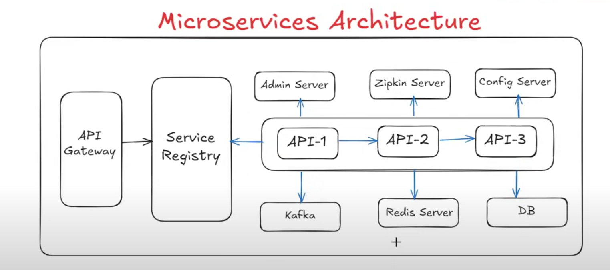

## Microservices Services

There is no fixed architecture for microservice architecture.

We can customize microservices architecture as per our requirement.

As part of microservices architecture, we are not going to use the below components.  
(All the below components are not mandatory; we can use them based on requirement.)

1) Service Registry (Eureka)  
2) Admin Server  
3) Zipkin Server  
4) Config Server  
5) Kafka Server  
6) Redis Server  
7) FeignClient  
8) API Gateway

# Service Registry

Service registry is used to maintain all microservices information in one place.

Information can have name, status, URL, and health of microservice.

It is also called a Service Discovery.

We can use Eureka Service as a service registry.

To set up the service registry for our application, we are going to use Eureka Server.

**Note:** Eureka Server is provided by the Spring Cloud library.  
It will provide you a GUI to get the user information.

---

# Admin Server

Admin Server is used to monitor and manage the APIs in one place.

**Note:** In Spring Boot, to monitor and manage the APIs, we have Actuators.

But in Microservices, we have Admin Server, which is used to monitor and manage the APIs in one place by providing you a GUI.

The GUI will have access to the API's actuator endpoints in one place.

What we can monitor and manage are as follows:

1) Health Check  
2) Config Props  
3) URL Mapping  
4) Bean Loaded  
5) Changing Log Levels  
6) Thread Dump  
7) Heap Dump

---

# Zipkin Server

Zipkin Server is used for distributed tracing of our request.

Example:  
1) How much time is taken to process one request?  
2) Which microservice is taking more time to process?  
3) How many services are involved in one request processing?

By using Zipkin server, we can track our request.

Zipkin Server will provide you a GUI to access the API's execution details.

---

# Config Server

Config Server is used to separate application code and configuration properties.

It is used to externalize configuration properties from our application.

Earlier, in Spring Boot applications, there was a file `application.properties` or `application.yml`, where all configurations were mentioned,  
like database configuration, Kafka configuration, Redis configuration.

So if you kept database configuration in the `application.properties` file, then it’s tightly coupled, but we need to separate configuration files and source code.  
That’s why we are going to use Config Server.

If we configure DB credentials in the `application.properties` file and in the future, we want to change that config, then again we need to go to the  
same `application.properties` file, change the credentials, and re-compile → re-package → re-deploy.

To avoid this, we will go with Config Server.

---

# FeignClient

FeignClient is used for interservice communications.

When one microservice/API wants to communicate with another microservice/API within the same application, then it is called interservice  
communication, and to achieve that, we can use FeignClient.

---

# API Gateway

It acts as an entry point for all backend APIs.

When a request comes from UI (React/Angular/etc.) to our application, it cannot access the APIs directly.

Any request coming to the API will first go to the API Gateway. The API Gateway will validate that request.

Example:
- Is the request valid or not?
- Is the request one we need to accept or not?

These kinds of checks will happen in the API Gateway.

If the request is valid, the API Gateway will forward that request.

If the request is invalid, the API Gateway will reject that request.

It will act as a mediator between frontend and backend APIs.

The API Gateway will contain filters and routing.

