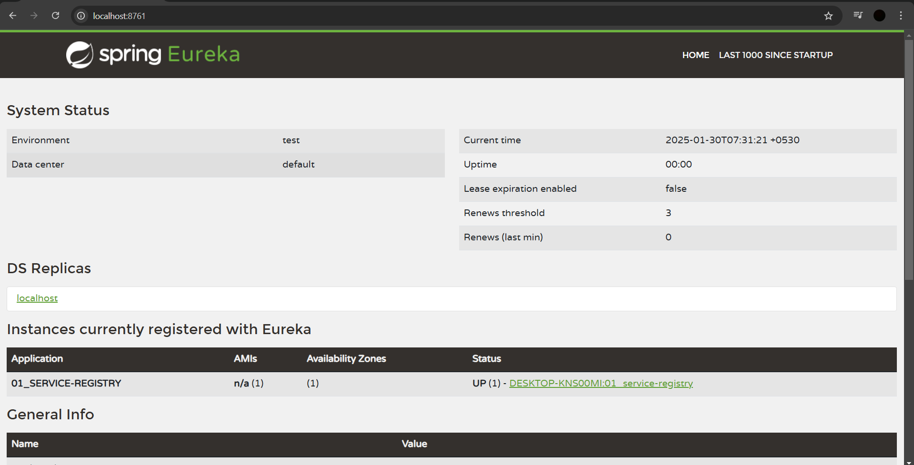
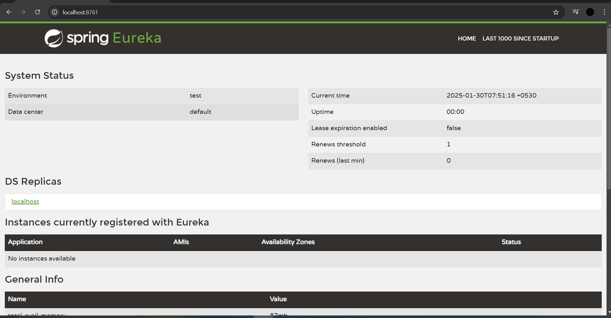

# Steps to develop Service Registry Application (Eureka Server)

1) Create Spring Boot Application with the below dependency:

    Eureka Server (spring-cloud-starter-netflix-eureka-server)

2) Configure `@EnableEurekaServer` annotation in the boot start class.

3) Configure the below `application.yml` properties:

    Default the port is 8080, but it is recommended to keep the port as 8761.

    server:
      port: 8761

If we use port 8761, then our backend microservices (APIs) will auto-register with our Eureka Server.  
So our APIs (API-1, API-2, API-3) will act as Eureka Clients.

If the application is running on another port, then we need to manually register our clients with the service registry.

Once the application is up, we can access our Eureka Dashboard at:  
    http://localhost:8761/

---

If you see in this dashboard, one client got registered, which is Eureka itself.

So Eureka is acting as both a client and a server.

I only want my APIs to be clients.

But I don't want the Eureka server to act as a client; it should only act as a server.  
So to disable that, we need to add the following in the properties file:

    eureka.client.register-with-eureka=false

By doing this, it will only act as a server, not as a client.
