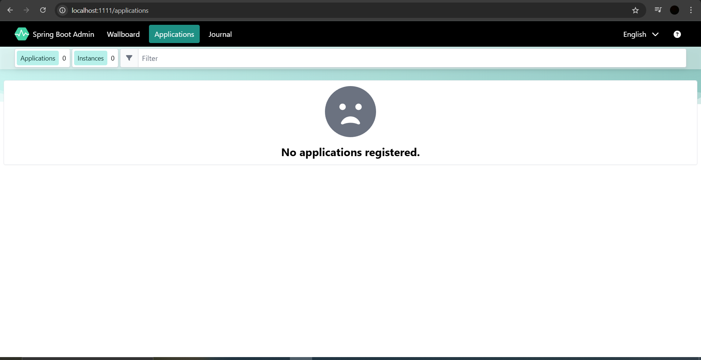

# Steps to develop Admin Server Application (Admin Server)

1) Create Spring Boot application with the admin-server dependency (Codecentric's Spring Boot Admin (Server)).

2) Configure `@EnableAdminServer` annotation in the start class.

3) Change port number (Optional). **Note:** Every microservice port number should be different.

4) Run the application.

5) Access Admin Server in the browser (We will be able to see the Admin Server Dashboard):

    http://localhost:1111/

---

