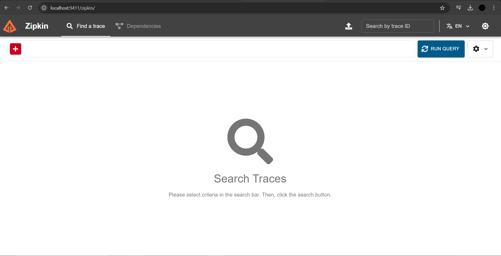

# Steps to work with Zipkin Server (Zipkin Server)

**NOTE:** We do NOT need to develop an application for the Zipkin server.

Zipkin server is already available on the internet.

1) We can download the Zipkin jar file from the internet:

    URL: https://zipkin.io/pages/quickstart.html

I have downloaded the latest version and saved that file in the Microservice Folder (where all my microservices files are present). You can store it according to your folder structure.

2) We need to download the jar file and run the file using the below command:

    Syntax: `java -jar <jar-name>`
    
    Example:  
    `G:\Microservices>java -jar zipkin-server-3.4.4-exec.jar`

3) The Zipkin server will run on port 9411.

4) Once the Zipkin server is started, you can access the server using the following URL:

    URL: http://localhost:9411/

---

