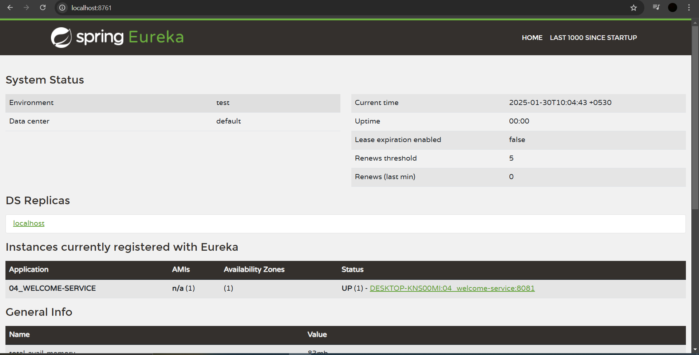
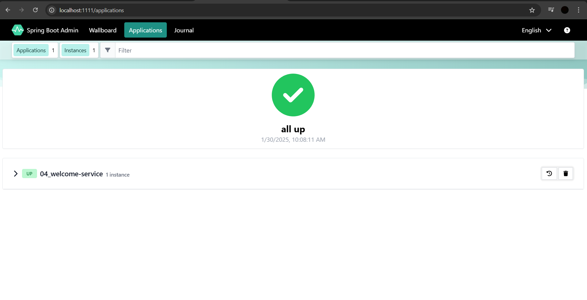
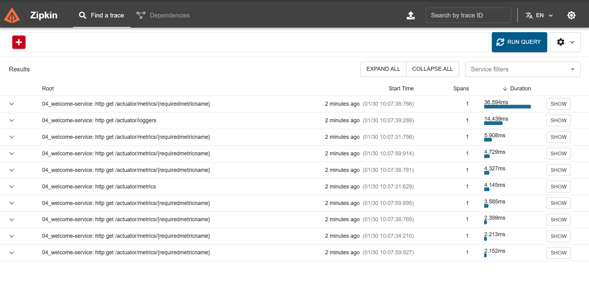
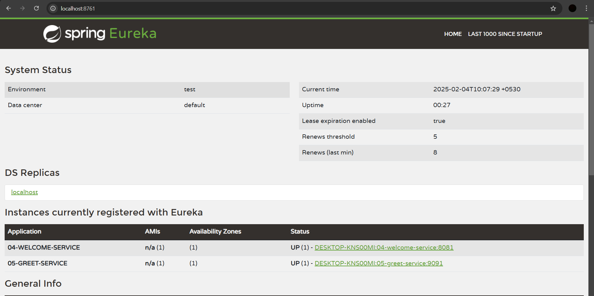
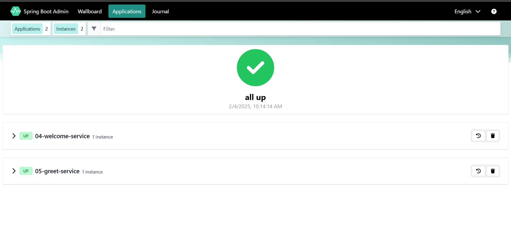
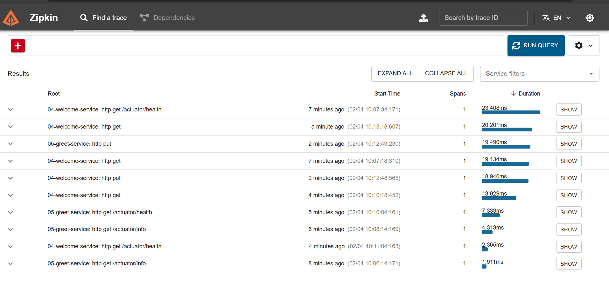

# Now it's time for creating microservices (API-1), (API-2), etc.

A microservice is nothing but our REST APIs.

These APIs will act as clients for the Service Registry, Admin Server, and Zipkin Server.

### Q) Why should our APIs act as clients for these servers?

- **Eureka Server** will provide the name of the service, status URL, etc.
- **Admin Server** will manage and monitor our microservices.
- **Zipkin Server** will provide distributed tracing for our microservices.

---

##############################
## Steps to develop Welcome API
##############################

1) Create a Spring Boot Application with the following dependencies:

    - **eureka-discovery-client**  
      To represent our application as a client for Eureka (Eureka dependency we added).
    
    - **admin-client**  
      To represent our application as a client for Admin (Admin dependency we added).
    
    - **zipkin**  
      To represent our application as a client for Zipkin (Zipkin dependency we added).
    
    - **starter-web**  
      To create our application as a REST API (we added starter-web).
    
    - **devtools**  
      To auto-load the dependencies without re-running the application (we added devtools).
    
    - **actuator**  
      To monitor and manage our application (we added actuator). Admin server will provide a UI to access the actuator endpoints.

2) Configure `@EnableDiscoveryClient` annotation in the boot start class.

3) Create a `RestController` with the required methods.

4) Configure the following properties in the `application.properties` file:

    - To change the server port, add the following property in the `application.properties` file:
    
      ```properties
      server.port=8081
      ```

    - To register our application with the Admin Server, add the following property in the `application.properties` file:
    
      ```properties
      spring.boot.admin.client.url=http://localhost:1111/
      ```

    - To configure the actuator endpoint for our application, add the following property in the `application.properties` file:
    
      ```properties
      management.endpoints.web.exposure.include=*
      ```

### NOTE:
Eureka Server is already running on port 8761, so by default, it will register the other clients. However, if you want to manually register the client to Eureka Server, you need to add the following property to the `application.properties` file:

```properties
eureka.client.service-url.defaultZone=http://localhost:8761/eureka/
```

5) Run the application and check in Eureka Server (It should display in Eureka Dashboard)

6) Check Admin Server Dashboard (It should display) (We can  access application details from here)
	
	Ex: Beans, loggers, heap dump, thread dump, metrics, mappings etc.

7) Send request to REST API method

8) Check Zipkin Server UI and click on Run Query Button (It will display trace-id with details)

---




---



---



---

##############################
# Steps to develop Greet API
##############################

1) **Create Spring Boot Application with the below dependencies:**

   **Note:** We will add one new dependency `openfeign`.  
   `openfeign` is used for Feign Client.  
   It is used for interservice communication. In simple words, when one microservice (API) wants to communicate with another microservice (API), then we use Feign Client.

   - **eureka-discovery-client**  
     To represent our application as a client for Eureka (Eureka dependency we added).
   
   - **admin-client**  
     To represent our application as a client for Admin (Admin dependency we added).
   
   - **zipkin**  
     To represent our application as a client for Zipkin (Zipkin dependency we added).
   
   - **starter-web**  
     To create our application as a REST API (we added starter-web).
   
   - **devtools**  
     To auto-load the dependencies without re-running the application (we added devtools).
   
   - **actuator**  
     To monitor and manage our application (we added actuator). Admin server will provide a UI to access the actuator endpoints.
   
   - **openfeign**  
     For interservice communication between microservices, we need the `openfeign` dependency.

2) **Configure `@EnableDiscoveryClient` annotation at boot start class.**

3) **Create `RestController` with the required methods.**

4) **Configure the following properties in the `application.properties` file:**

   - To change the server port, we need to add the following property in the `application.properties` file:
     ```properties
     server.port=9091
     ```

   - To register our application with the admin server, we need to add the following property in the `application.properties` file:
     ```properties
     spring.boot.admin.client.url=http://localhost:1111/
     ```

   - To configure the actuator endpoint for our application, we need to add the following property in the `application.properties` file:
     ```properties
     management.endpoints.web.exposure.include=*
     ```

### NOTE:
Eureka Server is already running on port 8761, so by default, it will register the other clients. However, if you want to manually register the client to Eureka server, we need to add this property to the `application.properties` file:

```properties
eureka.client.server-url.defaultZone=http://localhost:8761/eureka/

```




---



---



---


