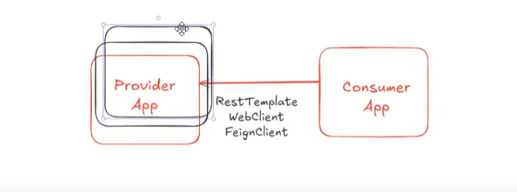
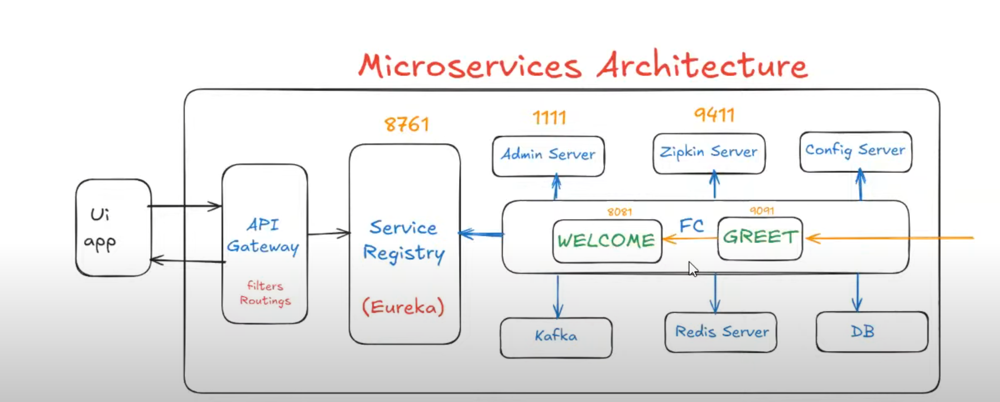

## Provider and Consumer Application Communication


In real-time applications, there will be a **Provider** and a **Consumer** Application available. The **Provider** will give services to another application, and the **Consumer** will access the services provided by the **Provider** Application.



To communicate with another application, we have three main ways:

1) **RestTemplate**  
2) **WebClient**  
3) **FeignClient**

In this case, we are going with **FeignClient**. 

### Why Not RestTemplate or WebClient? Why Only FeignClient?

- When we use **RestTemplate**, we need to write something like this:
  ```java
  rt.getFromEntity(url, ...)
  ```

Here, the URL needs to be specified, and it's kind of **hardcoded**.

When we go for **WebClient**, we need to write something like this:

```java
client.get(url, ...)
```

But in a real-time application, our server (i.e., provider) will run on multiple servers to avoid the load on a single server. This is called **Load Balancing**.

However, if we use **RestTemplate** or **WebClient**, we will need to pass only **one URL**. We can't pass the URLs of other servers running on different instances. This means we are only accessing one server, and the burden is getting increased on that server.

When using **RestTemplate** or **WebClient**, we need to specify the **URL**, and we can only specify a single URL, but our provider is running on multiple servers with multiple URLs.

So in real-time applications, our application will run on multiple servers to avoid the burden and balance the load across the servers. This concept is called **Load Balancing**.

### Why FeignClient Is the Best Option

**FeignClient** is the best option in this case.  
By using **FeignClient**, we can establish communication from one microservice to another by using the **name** of the microservice, not the **URL** of the microservice.

Generally, when we use **RestTemplate** or **WebClient**, we need to specify the **URL** of the microservice.  
If we have one provider (i.e., one server), then it will work, but if we have multiple servers, it will create a load on that server because we are passing only one URL.

---



### NOTE:
For **External Service Communication**, **RestTemplate** or **WebClient** is the best option.  
For **Internal Service Communication**, **FeignClient** is the best option.

