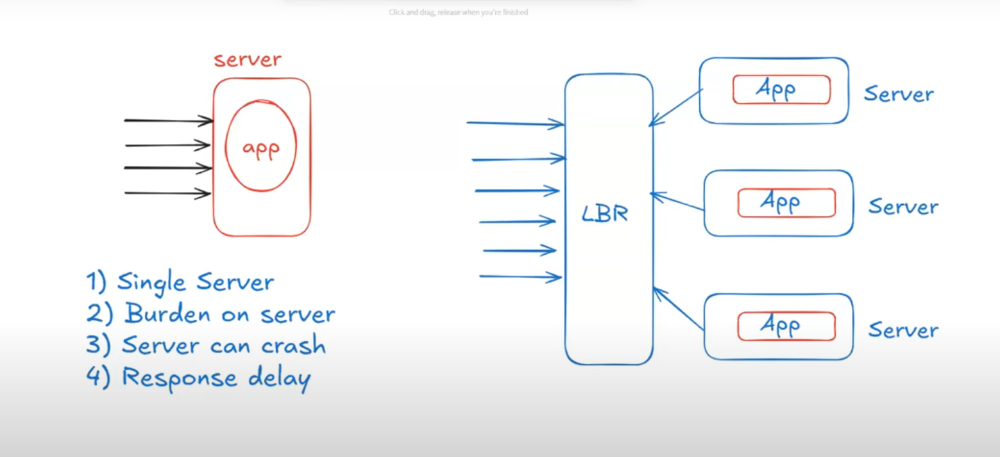
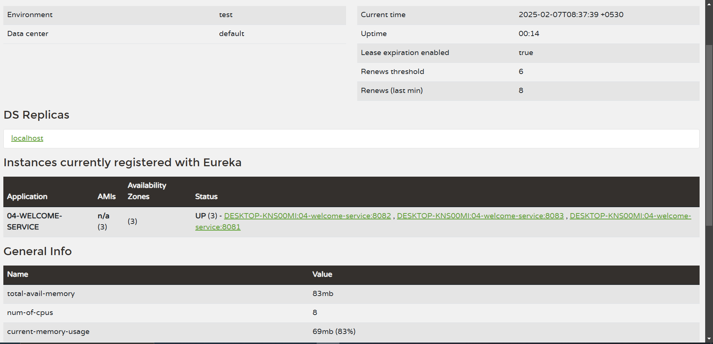

# Application Load Balancing



---

If we run our application on one server, then the burden will be increased on that one server.

## Challenges Using Single Server:

1) The single server will need to handle all the load  
2) Burden on the server  
3) Response delay  
4) Server can crash  
5) Single point of failure  

To overcome this problem, we will run our application on multiple servers so that we can distribute our application requests to multiple servers.

**Load Balancer** is used to distribute the requests to multiple servers.

## Advantages of Using Load Balancer:

1) Less burden on the server  
2) Quick response to clients  
3) No single point of failure  

**IMP NOTE**: To run our application on multiple servers, we need to do 3 steps:

1) To verify the port, you need to adjust some logic to see which port is calling that particular service.  
   To do that, I added this in the controller.

# Code Example for Controller

```java
package in.zahid.Controller;

import org.springframework.beans.factory.annotation.Autowired;
import org.springframework.core.env.Environment;
import org.springframework.web.bind.annotation.GetMapping;
import org.springframework.web.bind.annotation.RestController;

@RestController
public class WebRestController {
	
	@Autowired	// New Added Line
	private Environment env; // New Added Line
	
	@GetMapping("/welcome")
	public String getWelcomeMsg() {
		
		String port = env.getProperty("server.port"); // New Added Line
		String msg = "Welcome...( " + port + " )";	// Updated Line
		return msg;
	}
}

```

2) **Remove configuration in `server.port` from `application.properties`**  
   (I provided the port number at runtime)


3) **To provide port number `8081` at runtime:**  
   Select the project -> Run As -> Run Configurations... -> (Pop-up will open) Select **Arguments** -> Under **VM Arguments** add:  
   `-Dserver.port=8081`  
   Then **Apply** and **Run**.

4) **(Do the same 3rd step again to run on another server)**

5) **To provide port number `8082` at runtime:**  
   Select the project -> Run As -> Run Configurations... -> (Pop-up will open) Select **Arguments** -> Under **VM Arguments** add:  
   `-Dserver.port=8082`  
   Then **Apply** and **Run**.

6) **To provide port number `8083` at runtime:**  
   Select the project -> Run As -> Run Configurations... -> (Pop-up will open) Select **Arguments** -> Under **VM Arguments** add:  
   `-Dserver.port=8083`  
   Then **Apply** and **Run**.

**Check in Eureka Dashboard** and you will see 3 instances will be present for `welcome-service`.




