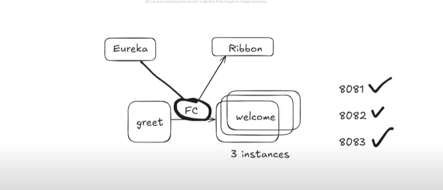
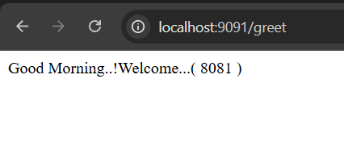
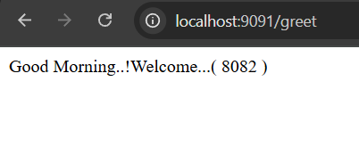
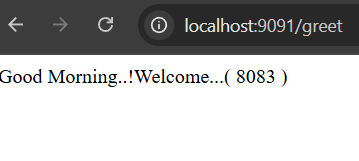

## Ribbon Concept

---

In Eureka Server Dashboard we can see our `welcome-service` is running on 3 different servers: 8081, 8082, 8083.

Here when we try to hit the `greet` API, which is internally communicating with `welcome-service` using **FeignClient**.

But the problem here is our `welcome-service` is running on 3 different ports, meaning it has 3 different URLs. Now, **FeignClient** will get confused about which URL to call.

First, there was only one port, `8081`, then it was using the same port, but now we have 3 ports for `welcome-service`, and now **FeignClient** is confused about which URL or port should be used.

Here, **Ribbon** comes into the picture.  
Whenever **FeignClient** gets more than one URL from the service registry (Eureka Dashboard), it will internally call **Ribbon**.  
**Ribbon** will take care of load balancing.

It will help **FeignClient** get the URL based on the **Round Robin** mechanism.  
The best thing is that **FeignClient** internally uses **Ribbon** to get those URLs, so we don't need to worry about the integration part.  
It will handle it automatically.

---

---

---

---
