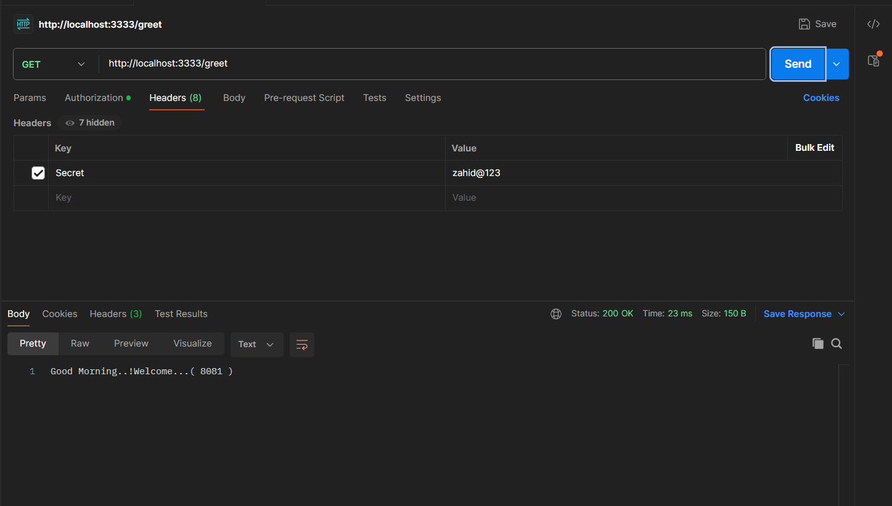

## Working With Spring Cloud API Gateway

1) **Create Spring Boot Application Using Below Dependencies**

   - eureka-client  
   - cloud-reactive-gateway  
   - devtools

2) **Configure `@EnableDiscoveryClient` annotation at the boot start class**

3) **Configure API Gateway Routings in `application.properties` file like below:**

   ```properties
   # Route 1
   spring.cloud.gateway.routes[0].id=api1
   spring.cloud.gateway.routes[0].uri=lb://04-WELCOME-SERVICE
   spring.cloud.gateway.routes[0].predicates[0]=Path=/welcome

   # Route 2
   spring.cloud.gateway.routes[1].id=api2
   spring.cloud.gateway.routes[1].uri=lb://05-GREET-SERVICE
   spring.cloud.gateway.routes[1].predicates[0]=Path=/greet
   ```
**Note**: These routes basically mean that when a request comes with `/welcome`, the request will be routed to `lb://WELCOME-SERVICE` (i.e., load balancer for `welcome-service`).  
When a request comes with `/greet`, the request will be routed to `lb://GREET-SERVICE` (i.e., load balancer for `greet-service`).

4) **Create filter to validate incoming request**


To validate the request, we need to pass some kind of key from the client side in the header so that we can verify if it is valid or not.

If the request contains the below header, then it is a valid request, and we will process that request:

**Secret=zahid@123**

If the above request is not present, then it's an invalid request, and we won’t process it.

**IMP NOTE:** This is just for the basic part. In real-time, we will use JWT tokens. For now, to understand the concept of the API gateway, we are passing this hardcoded secret.

```java
package in.zahid.filters;

import java.util.List;
import java.util.Set;

import org.springframework.cloud.gateway.filter.GatewayFilterChain;
import org.springframework.cloud.gateway.filter.GlobalFilter;
import org.springframework.http.HttpHeaders;
import org.springframework.http.server.reactive.ServerHttpRequest;
import org.springframework.stereotype.Component;
import org.springframework.web.server.ServerWebExchange;

import reactor.core.publisher.Mono;

@Component
public class MyFilters implements GlobalFilter {

    @Override
    public Mono<Void> filter(ServerWebExchange exchange, GatewayFilterChain chain) {
        
        System.out.println("Filter Method Executed...");
        
        // Validate request
        ServerHttpRequest request = exchange.getRequest();
        HttpHeaders headers = request.getHeaders();
        Set<String> keySet = headers.keySet();
        
        if (!keySet.contains("Secret")) {
            throw new RuntimeException("Invalid Request");
        }
        
        List<String> list = headers.get("Secret");
        if (!list.get(0).equals("zahid@123")) {
            throw new RuntimeException("Invalid Request");
        }
        
        return chain.filter(exchange);
    }
}
```
---
**NOTE:** To test, we can't use the browser now because it will return an error. This is because we have implemented the filters, so now our code is expecting headers.

### Postman Screenshots:

1. **Greet Request in Postman**:
   

2. **Welcome Request in Postman**:
   
