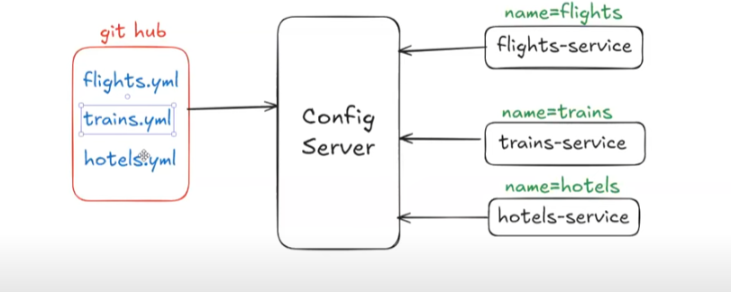
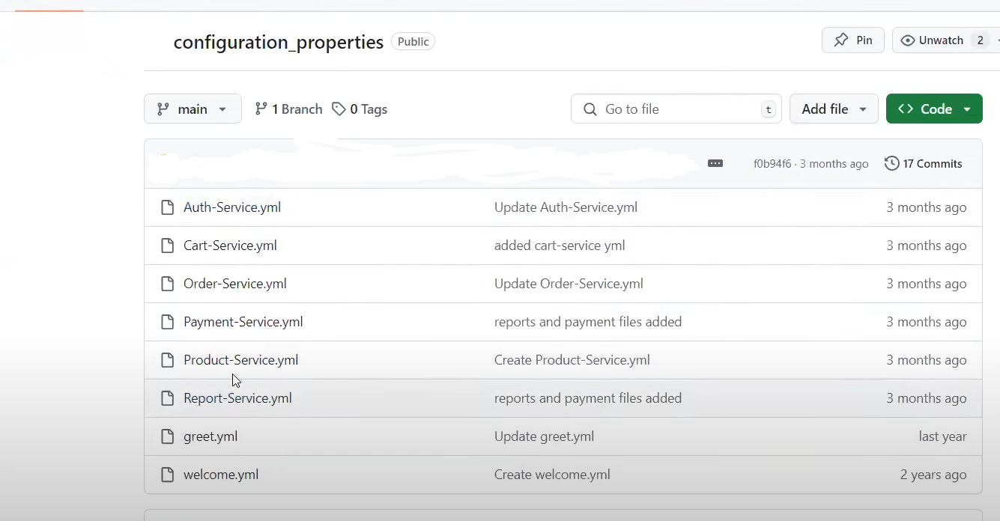
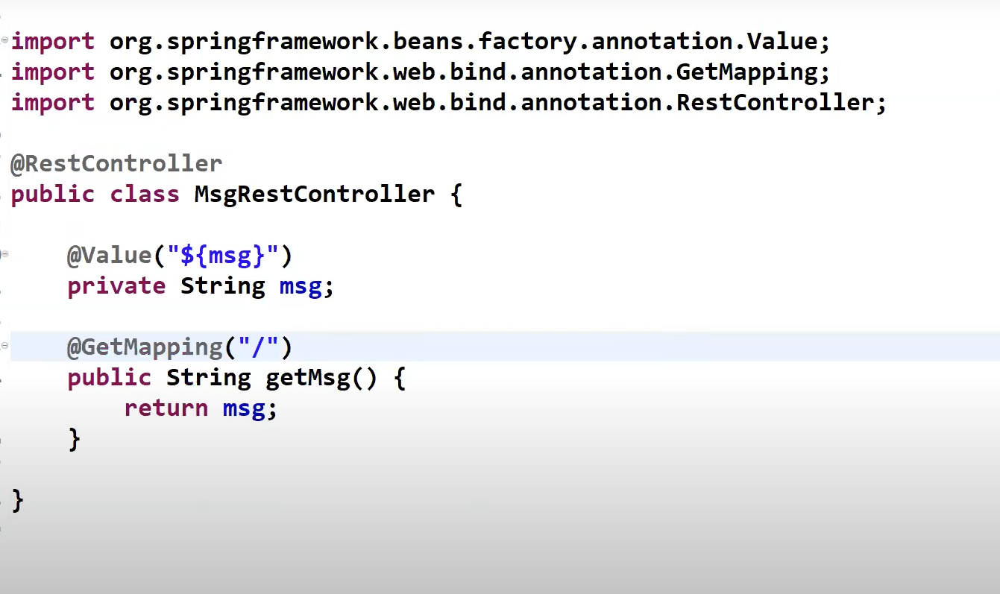
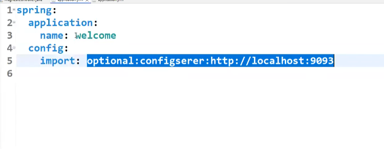
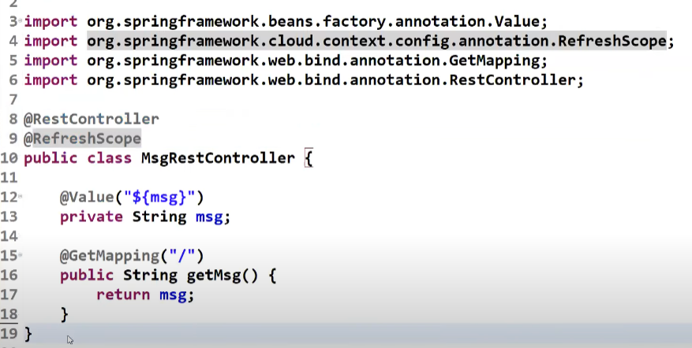
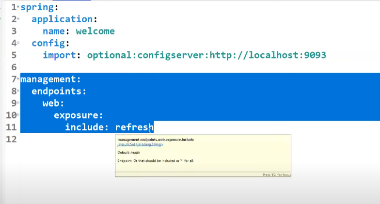
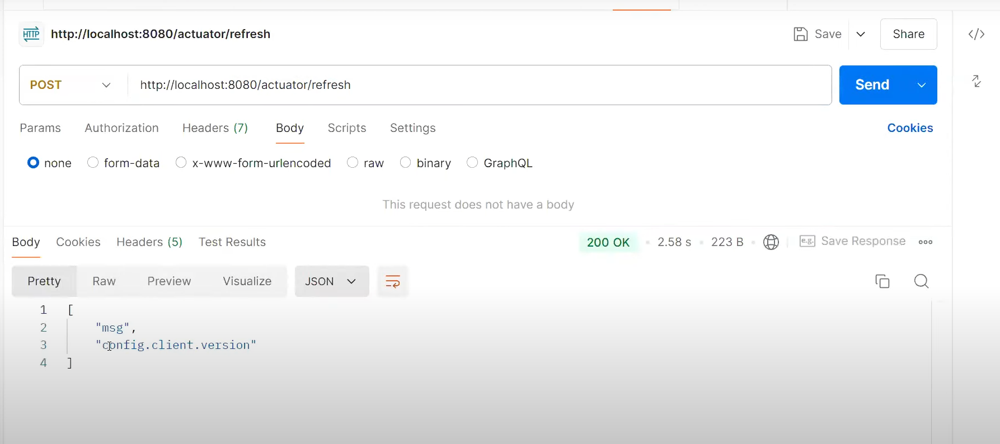

# Cloud Config Server

We are configuring our application config properties in `application.properties` or `application.yml` file.

Eg: DB Props, SMTP Props, Kafka Props, App Messages etc.

`application.properties` or `application.yml` file will be packaged along with our application (It will be part of the JAR file).

If we want to make any changes in our properties file, then we need to re-package and re-deploy the entire application again, which is time-consuming.

To avoid this, we need to separate our source code and project config properties files.

To externalize config properties from our application, we can use Spring Cloud Config Server.

---



---


In real-time, our `application.properties` or `application.yml` file will be maintained in our GitHub repo, and the Config Server will load them.
We also have different services that will be registered with the Config Server using their names.
Our microservices will act as clients for the Config Server.
So, based on these names, the Config Server will fetch the appropriate `.yml` or `.properties` file.

Cloud Config Server is part of our Spring Cloud library.

## Advantage of Using Config Server:

- The application will be loosely coupled with the properties file.

### IMPORTANT Note:
If our Config Server is down, then the entire project is down—that's the disadvantage of using the Config Server.


---

# Developing Config Server App

1) Create a Git Repository and keep `.yml` or `.properties` files required for microservices.

---



---

**Note:** We should keep the file name as the application name.

- App name: greet → File name should be `greet.yml` or `greet.properties`
- App name: welcome → File name should be `welcome.yml` or `welcome.properties`

2) Create a Spring Starter application with the below dependency:
   (cloud config server)

   ```xml
   <dependency>
       <groupId>org.springframework.cloud</groupId>
       <artifactId>spring-cloud-config-server</artifactId>
   </dependency>
   ```

3) Write `@EnableConfigServer` annotation in the boot start class.

4) Configure the below properties in the properties file:

   ```properties
   spring.application.name=Config_Server
   spring.cloud.config.server.git.uri="git repo url"  // This is the repo which will only have configuration properties for the microservice we developed in step 1.
   server.port=9093
   ```
5) Run our Config Server application.

---

# Developing Config Client App

1) Create a Spring Boot application with the below dependencies:

   - a) `web-starter`
   - b) `config-client`
   - c) `dev-tools`
   - d) `actuators`

2) Create a REST controller with the required methods.

---



---

**Note:** The `@Value` annotation is used to read the properties from the `application.properties` or `application.yml` file.

3) Configure the ConfigServer URL in `application.properties` or `application.yml` file like below:

---



---

**Note:** In our `application.properties` or `application.yml` file, we have stated our application name as `welcome` or `greet`, and also added a config import with the URL. 

This means that when the Config Client is called, it will check the application name. If it's `welcome`, then using the config import URL provided by the Config Server, it will call the server. The server, in turn, calls the Git URL to check the `.yml` or `.properties` file and returns the value.

**IMPORTANT Note:** Whatever name we are giving to the microservice, it will check the file with that name and load the information from that `.yml` file.
   
For example: If we give the microservice name as `welcome` and the config import is calling the URL of the repo where only our `.yml` or `.properties` files are present, it will check the `.yml` or `.properties` file from that repo. The name should match, and then it will return the values back to the client.

4) Run the application and test it.

**IMPORTANT Note:** By doing this, we can achieve loose coupling, where we don't need to re-package and re-deploy our application after making changes in the `.yml` or `.properties` file. 

When we make any change in `application.properties` or `.yml` file, we can simply rerun our application and reflect those changes in our application.

However, in real-time, we will not re-run our application after making changes in the configuration files repo, because that is not recommended. 

We have another approach where we can reload our properties dynamically without rerunning the application.

---

# Reload our Config Properties Dynamically

We need to make the below 3 changes to achieve that:

1) Configure `@RefreshScope` annotation at the Rest Controller class.

2) Enable actuator endpoints 'refresh'.

3) Send a POST request to the actuator endpoint 'refresh' from Postman.

---



---



---



---

Now, after hitting the endpoint through Postman, we can see our updated config reflected.

